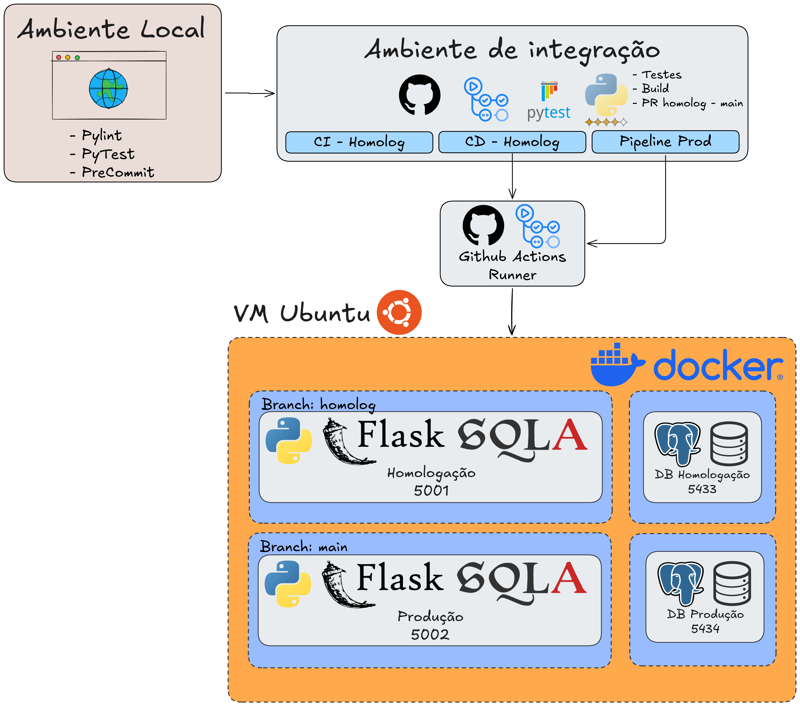

# ConfigFinance
test
A robust configuration management and financial control system built with Python, Flask, and PostgreSQL.

## Description

ConfigFinance is a web-based configuration management and financial tracking application. Backed by a PostgreSQL database, it features secure user authentication, transaction recording (launches), dynamic data filtering, and automatic PDF report generation. The application is designed for reliability, featuring automated testing suites via PyTest, static code analysis via Pylint, and structured database migrations via Alembic.

The application serves as a comprehensive system demonstrating the use of modern Client-Server patterns, Service-oriented patterns for data management, and containerized deployment workflows (Docker & Docker Compose) managed through custom CI/CD pipelines.

## Stack

The application leverages the following technology stack:

- **Core Backend**: Python 3.12, Flask (handling HTTP routing, session management, and application context)
- **Database Layer**: PostgreSQL 16 (relational database), querying handled via raw SQL with `psycopg2-binary`
- **Frontend Layer**: HTML5, Vanilla CSS3 (implementing a premium, responsive Glassmorphism Dark Mode aesthetic), Jinja2 templates (server-side rendering)
- **Document Generation**: WeasyPrint (HTML to PDF converter)
- **Testing Suite**: PyTest & PyTest-Mock (intercepting the database pipeline for isolated validation)
- **Configuration**: python-dotenv (environment variable configuration)
- **Database Migrations**: Alembic
- **Containerization**: Docker & Docker Compose

## Architecture

The system utilizes a structured Client-Server architecture with clean separation of concerns:

1. **Client / Presentation Layer**: Server-rendered HTML templates utilizing a responsive CSS grid/flexbox layout, styled with modern typography and interactive modal dialogs.
2. **Controller / Application Layer**: [app.py](file:///d:/Desktop/trabalho_quinta/task2-configurationManagment/app.py) handles HTTP requests, routes, user session states, and coordinates inputs with the service layer.
3. **Service Layer**: Database queries and business logic are decoupled from routes and stored inside service classes:
   - [services/lancamentos_service.py](file:///d:/Desktop/trabalho_quinta/task2-configurationManagment/services/lancamentos_service.py) handles financial transaction processing, querying, insertion, and aggregation.
   - [services/usuario_service.py](file:///d:/Desktop/trabalho_quinta/task2-configurationManagment/services/usuario_service.py) manages authentication, hashing validation, and user querying.
4. **Database / Persistence Layer**: A PostgreSQL database container storing configuration and transaction schemas, updated sequentially by Alembic migration scripts.

Below is the visualized system architecture:



## getting started

### Prerequisites

- **Operating System**: Linux (Debian/Ubuntu recommended) or macOS
- **System Libraries**: Essential libraries for WeasyPrint to generate PDF reports:
  ```bash
  sudo apt-get install -y libcairo2 libpango-1.0-0 libpangocairo-1.0-0
  ```
- **System Utilities**: Python 3.12, pip, and PostgreSQL client (`psql`) installed on the host.

### Local Installation

1. **Clone the Repository**
   ```bash
   git clone https://github.com/DanielCorbellini/task2-configurationManagment.git
   cd task2-configurationManagment
   ```

2. **Configure Environment Variables**
   Create a `.env` file in the root directory:
   ```bash
   cp .env.example .env
   ```
   *Note: Ensure you set a random `SECRET_SESSION_KEY` inside `.env` to secure Flask sessions.*

3. **Run the Automated Setup**
   Execute the setup script [setup.sh](file:///d:/Desktop/trabalho_quinta/task2-configurationManagment/setup.sh) to automatically configure the virtual environment, install requirements, and seed the database schema using `dump.sql`:
   ```bash
   chmod +x setup.sh
   ./setup.sh
   ```

4. **Start the Application**
   Run the Flask server within the created virtual environment:
   ```bash
   venv/bin/python app.py
   ```
   Access the app at [http://localhost:5000](http://localhost:5000) or [http://127.0.0.1:5000](http://127.0.0.1:5000).

### Running Tests

The application utilizes PyTest to validate database integrations and route handlers:
1. Activate the environment:
   ```bash
   source venv/bin/activate
   ```
2. Execute the test suite:
   ```bash
   python -m pytest tests/ -v
   ```

### Application Interfaces

#### Login Interface


#### Dashboard Interface


## CI/CD workflows

The repository contains automated pipelines configured via GitHub Actions for code analysis, testing, and deployment across multiple environments:

1. **Static Analysis & Linting**
   - **Configuration**: [pylint.yml](file:///d:/Desktop/trabalho_quinta/task2-configurationManagment/.github/workflows/pylint.yml)
   - Runs `pylint` analysis across all Python source files on code pushes and workflow invocations.

2. **Automated Testing Suite**
   - **Configuration**: [tests.yml](file:///d:/Desktop/trabalho_quinta/task2-configurationManagment/.github/workflows/tests.yml)
   - A reusable workflow that provisions a PostgreSQL 16 container, runs the PyTest suite, and generates code coverage summaries.

3. **Homologation CI (Integration & Pull Request)**
   - **Configuration**: [homolog-ci.yml](file:///d:/Desktop/trabalho_quinta/task2-configurationManagment/.github/workflows/homolog-ci.yml)
   - Triggered manually (`workflow_dispatch`) on the `homolog` branch.
   - Runs code quality analysis and tests, builds a new Docker container image, pushes the image to GitHub Container Registry (GHCR) with the `:homolog` tag, and automatically opens a PR from `homolog` to `main`.

4. **Homologation CD (Continuous Deployment)**
   - **Configuration**: [homolog-cd.yml](file:///d:/Desktop/trabalho_quinta/task2-configurationManagment/.github/workflows/homolog-cd.yml)
   - Triggered manually (`workflow_dispatch`) to deploy on a self-hosted runner.
   - Updates target folder contents, generates environment configurations, logs into GHCR, pulls the latest homologation image, boots the DB service, runs database migrations inside a temporary container (`alembic upgrade head`), and restarts the web application.

5. **Production Pipeline (CI/CD)**
   - **Configuration**: [prod.yml](file:///d:/Desktop/trabalho_quinta/task2-configurationManagment/.github/workflows/prod.yml)
   - Triggered manually on the `main` branch.
   - Runs validation tests, builds and pushes the production Docker image with the `:main` tag to GHCR, and deploys it to the production folder on the self-hosted runner, running migrations and updating containers.

6. **Infrastructure Setup**
   - **Configuration**: [setup-vm.yml](file:///d:/Desktop/trabalho_quinta/task2-configurationManagment/.github/workflows/setup-vm.yml)
   - A bootstrap pipeline to provision a clean virtual machine by installing Docker, setting up Docker Compose plugins, adding user groups, and preparing target deployment directories.

## Alembic how to run

1. Import the new model in [migrations/env.py](file:///d:/Desktop/trabalho_quinta/task2-configurationManagment/migrations/env.py) (if it is a new model).
2. Generate the migration revision:
   ```bash
   alembic revision --autogenerate -m "description of change"
   ```
3. Apply the migration:
   ```bash
   alembic upgrade head
   ```
